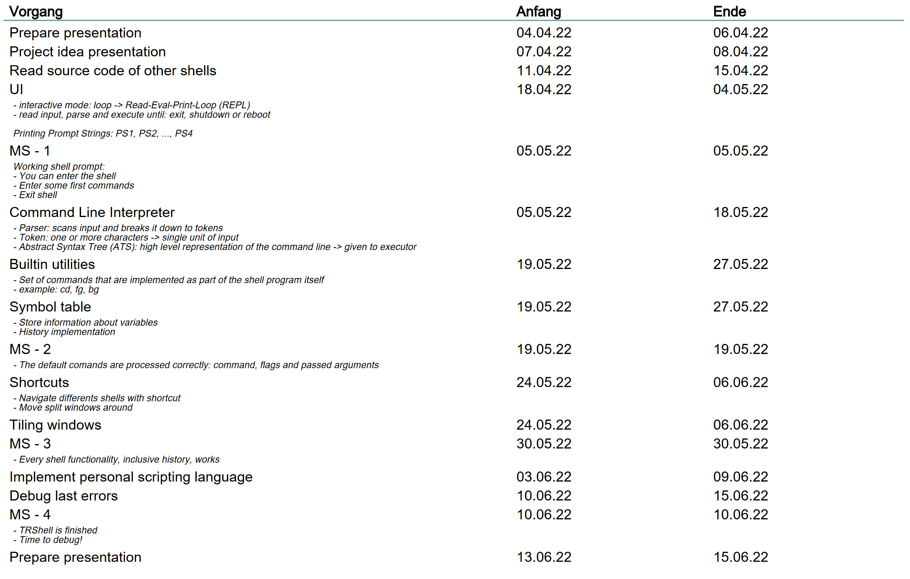

# Project Idea
## Motivation
- Interested in the inner workings of Linux
- We like optimizing workflows
- We love shortcuts
- Tiling window workflow

# Project Idea
## Importance
- simple layout
- easy to overview multiple shells
- focus on running multiple jobs
- intuitive to use
- minimalistic but appealing appearance

## Implementation
- C Language (maybe some x86 Assembler)
- Python 3
- TRSh scripting xD (.trsh)

# Hardware / Software Requirements
## Setup
- Linux operating system
- gcc & gdb for compilation and debugging of C code
- editor to write code
- easy as required tools are part of most Linux distros by default

# Time Plan

